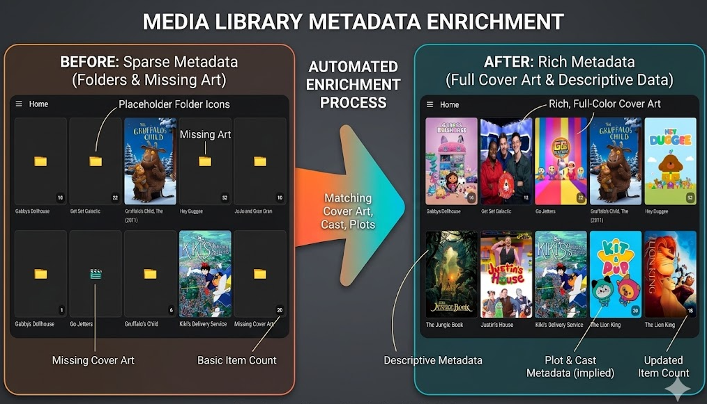
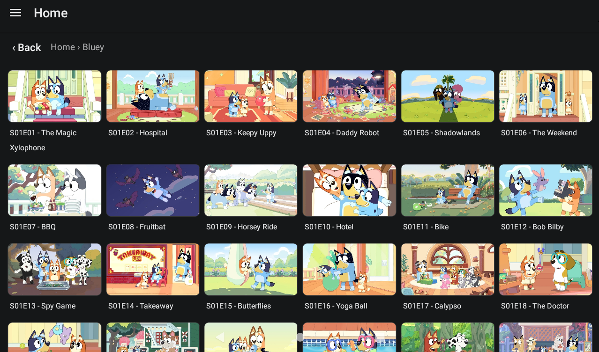

# SimpleMediaBrowser

A local media browser for Android. Point it at folders on your device or network storage and it organises your TV shows, movies and audiobooks into a clean, browsable library — with posters and metadata pulled automatically from [TMDB](https://www.themoviedb.org/) and cover art for audiobooks from the [iTunes Search API](https://performance-partners.apple.com/search-api).

## Features

- **Automatic library scanning** — Add one or more media source folders via Android's Storage Access Framework (SAF). The scanner recursively discovers TV episodes, movies and audiobooks and streams results into the library as they are found.
- **TV show, movie & audiobook views** — Browse all media together or switch to dedicated TV, Movies and Audiobooks tabs. TV content can be viewed structurally in different ways (shows/seasons/episodes or all seasons flattened etc.).
- **Audiobook support** — Point a source folder at your audiobooks (mp3, m4a, m4b, etc.). Multiple audio files in the same folder are grouped as a single multi-part audiobook, and cover art is fetched automatically from the iTunes Search API (no API key required).
- **Local metadata enrichment** — Standard metadata (folder.png etc.) will automatically be consumed as the library is scanned.
- **Cloud metadata enrichment** — Enter a TMDB or TheTVDB API key in Settings to fetch official titles, years, and poster artwork automatically. Posters are cached locally so the library is usable offline after the first fetch.
- **Video thumbnail generation** — Thumbnails are generated for episodes and movies that have no poster, persisted to disk, and reused across sessions.
- **Metadata overrides** — An edit-mode allows changes to any items title, poster, or other metadata and override what was fetched automatically.
- **Flexible display options** — Choose between grid and list layouts, adjust poster/thumbnail scale, and select landscape or portrait orientation modes.
- **Parent-mode** — Includes password-protection for all settings pages, so that the usual user is limited to selecting media to watch.
- **Dark & light theme** — Follows the system colour scheme automatically.
- **Debug log viewer** — An in-app log screen captures scan and metadata activity to help diagnose issues without needing a connected debugger.


The library can be enriched with metadata to ensure the best possible user experience.


Enrichment includes per-episode images, so the user can see which one they are selecting.

## Tech Stack

| Layer | Technology |
|---|---|
| Framework | [Expo](https://expo.dev) SDK 55 / React Native 0.83 |
| Navigation | Expo Router (file-based) with drawer + tab layouts |
| State | Redux Toolkit + redux-persist |
| File access | expo-file-system (SAF / Storage Access Framework) |
| Metadata | TMDB / TheTVDB REST APIs (TV & movies), iTunes Search API (audiobook cover art) |
| Video | expo-video (thumbnail generation via expo-image-manipulator) |
| List rendering | @shopify/flash-list |

## Getting Started (Development)

1. Install dependencies:

   ```bash
   npm install
   ```

2. Start the Expo dev server:

   ```bash
   npx expo start
   ```

From the dev server you can open the app in a [development build](https://docs.expo.dev/develop/development-builds/introduction/) or an [Android emulator](https://docs.expo.dev/workflow/android-studio-emulator/).

> **Note:** The app targets Android. iOS and web builds are not actively maintained.

## Building a Release APK

### Prerequisites

Full environment setup guide: <https://docs.expo.dev/get-started/set-up-your-environment/?platform=android&device=physical&mode=development-build&buildEnv=local#set-up-an-android-device-with-a-development-build>

Windows quick-start steps:

1. Install [Node.js](https://nodejs.org/)
1. Install Java JDK 17: `choco install -y microsoft-openjdk17`
1. Install [Android Studio](https://developer.android.com/studio) and use the SDK Manager to install the required SDK platforms and build tools
1. Set the `ANDROID_HOME` environment variable and add `%ANDROID_HOME%\platform-tools` to `PATH`
1. Verify ADB is available: `adb --version`
1. (Optional) Install EAS CLI if you plan to use Expo's cloud build service: `npm i -g eas-cli` then `eas build:configure`

### Build

```bash
npx expo prebuild
cd android
.\gradlew assembleRelease
```

The signed APK will be output to `android/app/build/outputs/apk/release/`.

